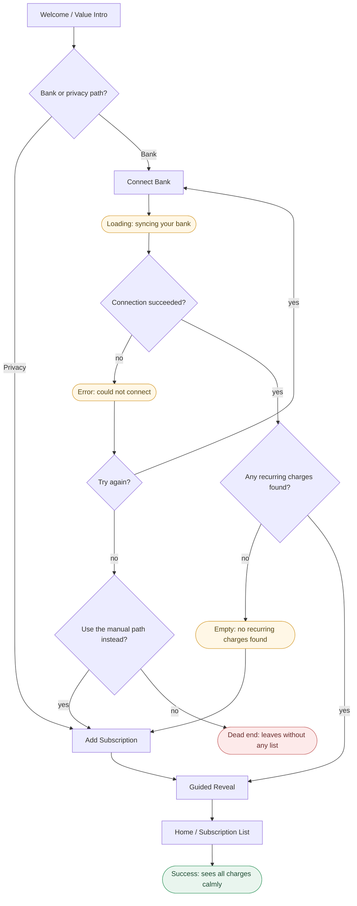
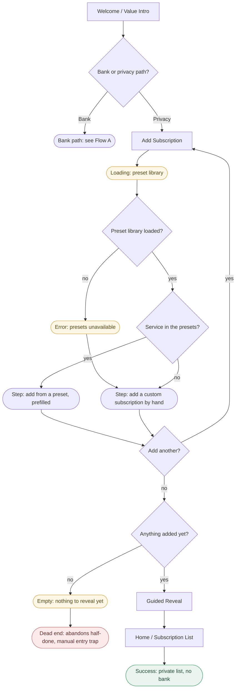
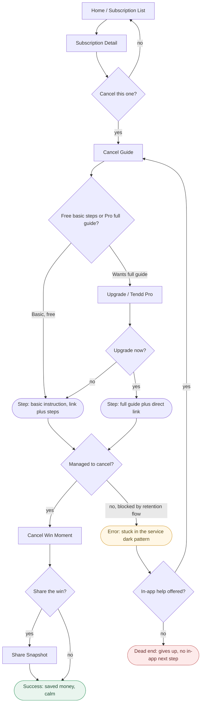
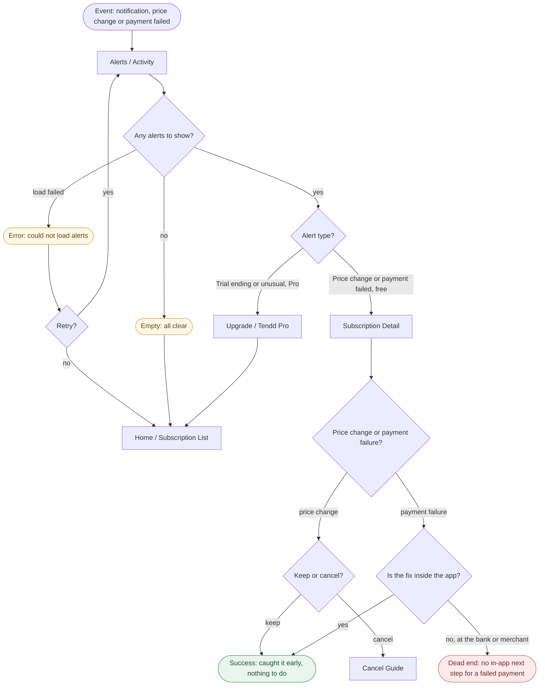

# Flows - Tendd

Phase IA, Prompt 1: Information Architecture. How the personas actually move
through the product, with decision points, states, and dead ends, not just
the happy path. Structure only, no per-screen content.

Reading the diagrams:
- **Rectangle nodes `[ ]` are screens.** Every rectangle here matches a
  screen name in ia/docs/sitemap.md. No new screens are introduced.
- **Diamonds `{ }` are decision points** with labeled branches.
- **Stadium nodes `( )` are states, steps, events, or outcomes**, not
  screens. Amber = a loading, empty, or error state. Green = a success end.
  Red = a dead end where the person could get stuck.

The dead ends are drawn on purpose. They are the honest failure points a
person could hit, and the Critique section of ia/docs/sitemap.md lists them
as defects with fixes. They are not accepted as normal.

---

## Flow A: J-MAIN, see all recurring charges calmly (Emma, bank path)

The main job, first session, bank-connected path. Ends at the calm list.

**Decisions:**
- Bank or privacy path? The first fork, given equal weight per D2. Privacy
  hands off to Flow B.
- Connection succeeded? If the bank link fails.
- Try again? After a connection error.
- Use the manual path instead? The recovery offer if the user will not
  retry the bank connection.
- Any recurring charges found? A clean connection can still surface nothing.

**States:**
- Loading: syncing your bank (after Connect Bank).
- Error: could not connect (bank link failed).
- Empty: no recurring charges found (connected, but nothing detected).
- Success: sees all charges calmly (the intended end).

**Dead end (defect, see Critique):** "leaves without any list" if the user
declines both retry and the manual fallback. The Guided Reveal is drawn as
one node; internally it is gradual per D1 (count, then categories with logos,
then total paired with an action).

---

## Flow B: J5, track without sharing bank data (Ravi, manual + presets)

The privacy path, manual entry with the 400+ preset library (D2). The
manual-entry trap (Ravi P1) is the risk this flow must survive.

**Decisions:**
- Bank or privacy path? Same fork as Flow A; the bank branch points back to
  Flow A.
- Preset library loaded? The preset library is launch-critical per D2, so
  its failure is a real state.
- Service in the presets? Found means prefilled and fast; not found means
  manual custom entry.
- Add another? The loop that builds the list.
- Anything added yet? Guards the reveal against being empty.

**States:**
- Loading: preset library.
- Error: presets unavailable (fallback is manual custom entry).
- Empty: nothing to reveal yet.
- Success: private list, no bank.

**Dead end (defect, see Critique):** "abandons half-done, manual entry trap."
Ravi has twice abandoned manual entry in the research. If nothing pulls him
back, he leaves with a half-built list.

---

## Flow C: J2 + E2, find, cancel, and feel the win (Claudia)

The cut job and the pride moment. Basic cancel instruction is free (D3); the
full guide and direct link are Pro. The external dark pattern is the risk.

**Decisions:**
- Cancel this one? From a subscription's detail.
- Free basic steps or Pro full guide? The D3 split, never a hard paywall on
  the relief moment.
- Upgrade now? If the user wants the Pro depth. Declining still returns the
  free basic instruction, so the moment is never blocked.
- Managed to cancel? The real-world outcome of an external cancellation.
- In-app help offered? Whether the product catches a blocked cancellation.
- Share the win? Optional, per S1.

**States:**
- Error: stuck in the service dark pattern (the external retention flow).
- Success: saved money, calm.

**Dead end (defect, see Critique):** "gives up, no in-app next step" if a
blocked cancellation is not caught with an in-app help path.

---

## Flow D: J4, stay ahead of a surprise (alert to action)

Entry is a notification (the return hook, research BP4). Price change and
payment-failed alerts are free; trial-ending and unusual are Pro (D3).

**Decisions:**
- Any alerts to show? Splits into loaded, empty, or a load failure.
- Retry? After a failed load.
- Alert type? Free alerts open the subscription; Pro alerts hit the upgrade
  gate.
- Price change or payment failure? Routes to the right next step.
- Keep or cancel? A price change either is accepted or hands off to Flow C.
- Is the fix inside the app? A failed payment is usually fixed at the bank or
  merchant, which is the risk below.

**States:**
- Error: could not load alerts.
- Empty: all clear (a calm, healthy empty state, not a dead end).
- Success: caught it early, nothing to do.

**Dead end (defect, see Critique):** "no in-app next step for a failed
payment" when the fix lives at the bank or merchant and the app stops at
"informed" without telling the person what to do next.
